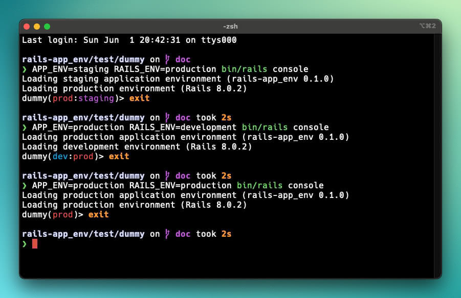

<div align="center">

# Rails APP_ENV

[](https://badge.fury.io/rb/rails-app_env)
[](https://github.com/typisttech/rails-app_env/actions/workflows/ci.yml)
[](https://github.com/typisttech/rails-app_env/blob/master/LICENSE.txt)
[](https://x.com/tangrufus)
[](https://bsky.app/profile/tangrufus.com)
[](https://github.com/sponsors/tangrufus)
[](https://typist.tech/contact/)

<p>
  <strong>
    <code>Rails APP_ENV</code> is like <code>RAILS_ENV</code> but for configurations only.
  </strong>
  <br>
  <br>
  Built with ♥ by <a href="https://typist.tech/">Typist Tech</a>
</p>

</div>

---

## Quick Start

TODO.

## Why

TODO.

## `RAILS_ENV` vs `APP_ENV`

TODO.

## Features

### `Rails.app_env`

`Rails.app_env` is like [`Rails.env`](https://api.rubyonrails.org/classes/Rails.html#method-c-env) but it is set by the
`APP_ENV` environment variable (`ENV["APP_ENV"]`).

It is optimization for `staging` and `review` ([the two extra Heroku pipeline stages](https://devcenter.heroku.com/articles/pipelines)),
so it doesn't need to rely on the slower delegation through `method_missing` that `ActiveSupport::EnvironmentInquirer`
would normally entail.

```ruby
## Assume we booted Rails with `APP_ENV=staging RAILS_ENV=production`
Rails.app_env # => "staging"
Rails.app_env.staging? # => true
Rails.app_env.production? # => false
Rails.app_env.any_other_predicate? # => false

Rails.env # => "production"
Rails.env.staging? # => false
Rails.env.production? # => true
```

In case `ENV["APP_ENV"]` is blank, `Rails.app_env` falls back to `Rails.env`.

### `Rails.application.app_config_for`

`Rails.application.app_config_for` wraps[`Rails.application.config_for`](https://api.rubyonrails.org/classes/Rails/Application.html#method-i-config_for)
with `{env: Rails.app_env}` as the second argument.

```ruby
# These two lines are equivalent.
Rails.application.app_config_for(:foo)
Rails.application.config_for(:foo, env: Rails.app_env)
```

### Credentials

`Rails APP_ENV` overrides the default Rails credentials `content_path` and `key_path` according to `Rails.app_env`.

Given the following `*.yml.enc` and `*.key` files under `config/credentials/`, `APP_ENV=staging RAILS_ENV=production`
would load the credentials from `config/credentials/staging.yml.enc` and `config/credentials/staging.key`.

```console
$ tree config/credentials
config/credentials
├── production.key
├── production.yml.enc
├── staging.key
└── staging.yml.enc
```

In case `config/credentials/#{Rails.app_env}.yml.enc` does not exist, it falls back to `config/credentials.yml.enc`.

In case `config/credentials/#{Rails.app_env}.key` does not exist, it falls back to `config/master.key`.

As with default Rails behaviours, if `ENV["RAILS_MASTER_KEY"]` is present, it takes precedence over
`config/credentials/#{Rails.app_env}.key` and `config/master.key`.

As with default Rails behaviours, when invoking `$ rails credentials` commands, specific the `--environment` option
instead of using `APP_ENV` and `RAILS_ENV`.

```console
# APP_ENV and RAILS_ENV are ignored.
$ APP_ENV=foo RAILS_ENV=bar bin/rails credentials:edit --environment qaz
      create  config/credentials/qaz.key
      create  config/credentials/qaz.yml.enc
```

Learn more in the [Heroku](#heroku) section below.

### Console

Whenever Rails console is started, `Rails APP_ENV` prints the current `Rails.app_env` and gem version to the console.

If the `Rails.app_env` differs from `Rials.env`, `Rails APP_ENV` appends `Rails.app_env` to the console prompt.



## Heroku

TODO.

## Installation

Install the gem and add to the application's `Gemfile` or `gems.rb` by executing:

```bash
bundle add rails-app_env
```

## Prior Art

- [anyway_config](https://github.com/palkan/anyway_config)
- [config](https://github.com/rubyconfig/config)

## Credits

[`Rails APP_ENV`](https://github.com/typisttech/rails-app_env) is a [Typist Tech](https://typist.tech) project and
maintained by [Tang Rufus](https://x.com/TangRufus), freelance developer [for hire](https://typist.tech/contact/).

Full list of contributors can be found [on GitHub](https://github.com/typisttech/rails-app_env/graphs/contributors).

## Copyright and License

This project is a [free software](https://www.gnu.org/philosophy/free-sw.en.html) distributed under the terms of
the MIT license. For the full license, see [LICENSE](LICENSE).

## Contribute

Feedbacks / bug reports / pull requests are welcome.
